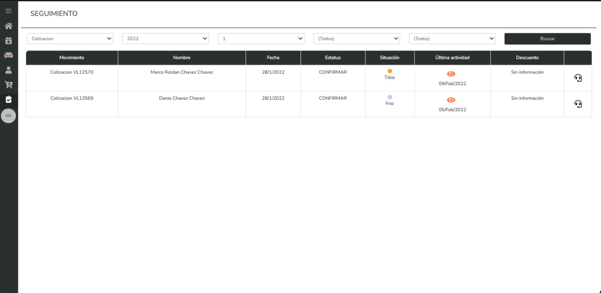
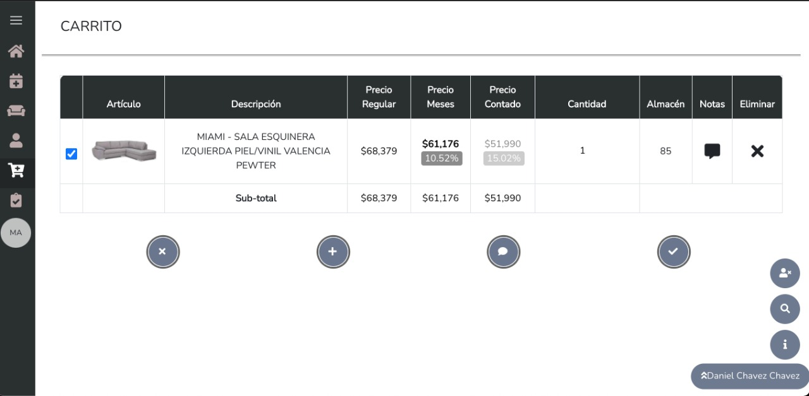
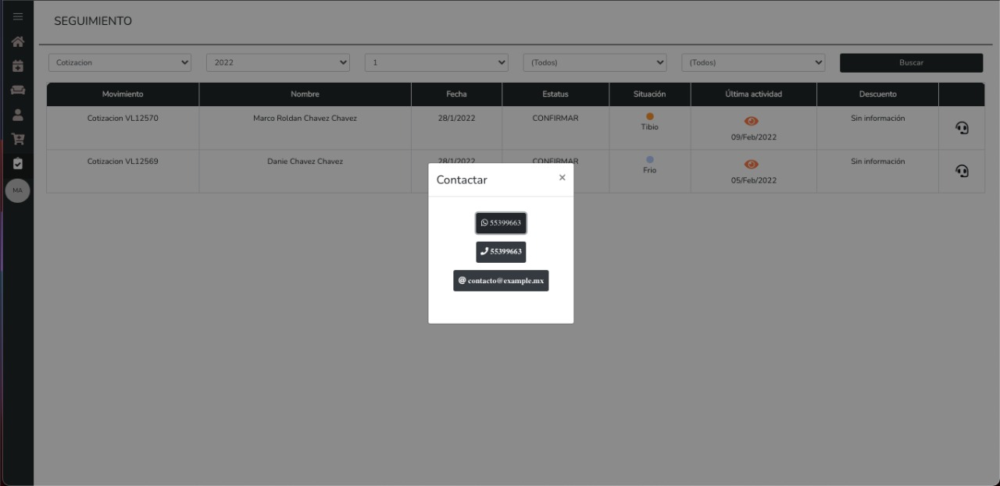

## Reportes

## Registro de clientes

Registre y administre a sus clientes.

## Cotizaciones

Seguimiento a cotizaciones.

## Termometro de Venta

Situación de tu posible venta FRIO / TIBIO / CALIENTE.

## Carrito

Selecciona un cliente previamente registrado, agrega ariculos al carrito.

## Comunicación con el Cliente

Via Llamada, WhatsApp, E-mail

## Calendario de actividades

El vendedor ve en el calendario las actividades que tiene por realizar durante el dia. 
Clientes con los que debe tener contacto, enviar cotizaciones, etc.

### `npm start`

Runs the app in the development mode. 
Open [http://localhost:3000](http://localhost:3000) to view it in the browser.

